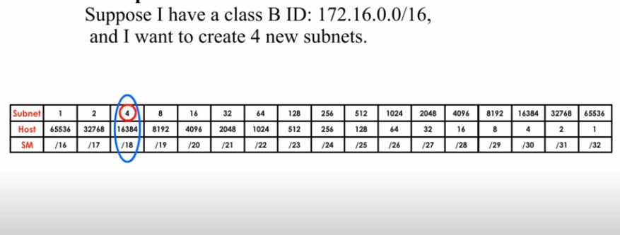
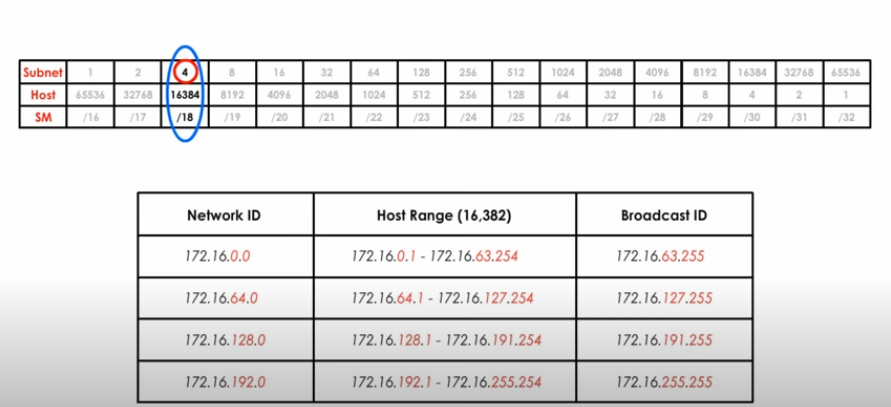
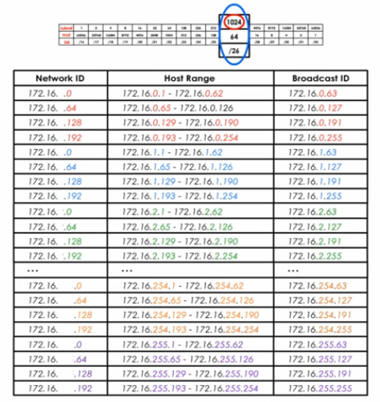
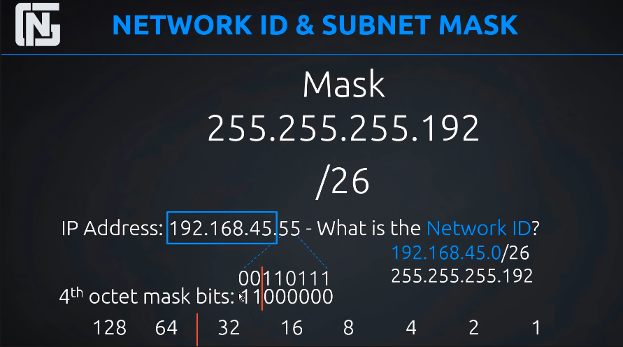
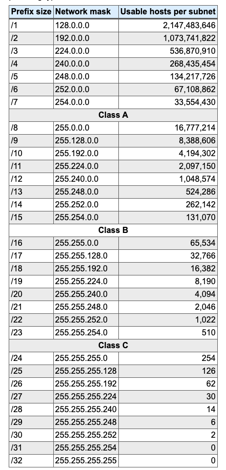

<a href="https://www.iana.org/assignments/service-names-port-numbers/service-names-port-numbers.xhtml">IANA</a> 
Service names and port numbers are used to distinguish between different
services that run over transport protocols such as TCP, UDP, DCCP, and
SCTP.

Service names are assigned on a first-come, first-served process, as
documented in [RFC6335].

Port numbers are assigned in various ways, based on three ranges: System
Ports (0-1023), User Ports (1024-49151), and the Dynamic and/or Private
Ports (49152-65535); the difference uses of these ranges is described in
[RFC6335]. According to Section 8.1.2 of [RFC6335], System Ports are 
assigned by the "IETF Review" or "IESG Approval" procedures described in 
[RFC8126]. User Ports are assigned by IANA using the "IETF Review" process, 
the "IESG Approval" process, or the "Expert Review" process, as per 
[RFC6335]. Dynamic Ports are not assigned.

The registration procedures for service names and port numbers are
described in [RFC6335].

Assigned ports both System and User ports SHOULD NOT be used without
or prior to IANA registration. 

<a href="https://www.webopedia.com/reference/well-known-tcp-port-numbers/">LIST OF WELL-KNOWN PORTS</a> 
Port numbers 0 to 1024 are reserved for privileged services and designated as well-known ports. This list of port numbers are specified in RFC 1700. 
- In TCP/IP and UDP networks, a port is an endpoint to a logical connection and the way a client program specifies a specific server program on a computer in a network. The port number identifies what type of port it is. For example, port 80 is used for HTTP traffic. Some ports have numbers that are assigned to them by the IANA, and these are called the “well-known ports” which are specified in RFC 1700.
- Port numbers range from 0 to 65535, but only port numbers 0 to 1023 are reserved for privileged services and designated as well-known ports. 

* Well-known ports range from 0 through 1023.
 
* Registered ports are 1024 to 49151.

* Dynamic ports (also called private ports) are 49152 to 65535.

<a href="https://www.youtube.com/watch?v=tSodBEAJz9Y">COMPUTER NETWORK</a> 
A collection of computers, servers, network devices connected to each other to share data. The devices on a network linked through cables, telephone lines, radio waves, or satellites. It has to be connection between each other. 

<a href="https://www.youtube.com/watch?v=IxO4WQzdOfA">LAN</a> 
A network in a single location is called Local Area Network(LAN). A home or office network is an example of a LAN. Usually restricted to a particular geographic region. Unlike a WAN, a LAN may reside in only a single location. 

<a href="https://www.youtube.com/watch?v=IxO4WQzdOfA">WAN</a> 
WAN stands for Wide Area Network. A network that is much more extensive than a LAN located on different geographic locations. WANs cover large geographical areas. WAN is an internetwork that connects multiple sites and spans large geographic regions. Usually employ both routers and public links. 

<a href="https://www.youtube.com/watch?v=Dxcc6ycZ73M&t=10s">INTERNET </a> 
Internet is considered the largest WAN in the world. A distributed packet-switched network.

<a href="https://www.youtube.com/watch?v=2uOgH2J4MzQ>">NODE</a>  
Point of connection, communication end-point. Any device that is  attached to a network, and is part of receiving, creating, or transmitting information. It is not necessary for a node to be a computer, it can be any communication device such as a printer, servers, modems, etc.. A node on a wireless network often called STATION.

<a href="https://www.youtube.com/watch?v=CwfTpGVa2wE">HOST</a> 
A host has to have IP address to function on the network. Every host is a node but every node is not a host. A host includes clients and servers in order to send or receive data.

WORKSTATION  
Powerful computer designed for technical or scientific applications. Used by one person at a time.  

<a href="https://www.youtube.com/watch?v=UjCDWCeHCzY&t=75s">SERVER</a>  
Servers are powerful computers. Servers are highly specialized and handle important labor-intensive jobs. In order to get better performance, a single task is often assigned to a dedicated server.(file server, mail server, print server, web server, etc.)

<a href="https://www.youtube.com/watch?v=CwfTpGVa2wE">CLIENT</a> 
A device that makes request from a server.

<a href="https://www.youtube.com/watch?v=mo4KlIFSPBo">TRANSMISSION MEDIA</a>  
A communication channel between nodes that carries the information from sender to the receiver. Data is transmitted throught the electromagnetic signals.A link between network nodes is created using some form of transmission media like cables, or radio waves. 

<a href="https://www.youtube.com/watch?v=pZOY0yczVAA">BACKBONE</a> 
A fast link among other segments of a network. Core infrastructure. Connects multiple networks, buildings, campuses and over geopgraphies. Actually a <a href="https://www.youtube.com/watch?v=kNQRssp34wQ">backbone network</a> allows multiple LANs to get connected.  

<a href="https://www.youtube.com/watch?v=zbqrNg4C98U&t=129s">TOPOLOGY</a> 
The arrangement  or layout of nodes of a computer network. Types of topologies are: Bus, Star, Ring, Mesh, Tree, Point-to-Point, Point-to-multipoint, Hybrid.

<a href="https://www.youtube.com/watch?v=zbqrNg4C98U&t=129s">PYHSICAL TOPOLOGY</a> 
Placement of various nodes.

<a href="https://www.youtube.com/watch?v=zbqrNg4C98U&t=129s">LOGICAL TOPOLOGY</a> 
Deals with the data flow in the network.

<a href="https://www.youtube.com/watch?v=_NX99ad2FUA">TWISTED PAIR CABLE</a> 
Twisted pair cable connects dissimilar and similar devices together. Twisting two wires as a pair minimizes interference and even protects against interference from outside sources. 

<a href="https://www.youtube.com/watch?v=_NX99ad2FUA">UTP</a> 
UTP stands for Unshielded twisted pair(UTP). UTP is common in Ethernet installations.The wires are twisted to prevent electromagnetic interference(crosstalk).

<a href="https://www.youtube.com/watch?v=_NX99ad2FUA">STP</a> 
STP stands for shielded twisted pair(STP). STP is used in various kinds of networks to prevent crosstalk and electromagnetic interference. The foil shield adds a layer of protection against electro-magnetic interference leaking into and out of the cable.

<a href="https://www.youtube.com/watch?v=eNa97A08wyU">FIBER-OPTIC CABLE</a> 
A type of cable that contains one or more optical fibers that are used to carry light. Optical fiber is a very thin strand of pure glass that acts as a waveguide for light over long distances. Fiber optic cable is actually composed of two layers of glass: The core which is thinner than hair carries the actual light signal, and the cladding is a layer of a glass surrounding the core. There are two types of optic cables: SMF and MMF

<a href="https://www.youtube.com/watch?v=eNa97A08wyU">SMF</a> 
SMF stands for Single-Mode Fiber. SMF has a very narrow core which allows only a single mode of light to propagate. 

<a href="https://www.youtube.com/watch?v=eNa97A08wyU">MMF</a> 
MMF stands for Multi-Mode Fiber. MMF has a much wider core, allowing multiple modes(or "rays") of light ot propagate. 

<a href="https://www.youtube.com/watch?v=g3RBb8wmB2E">EMI</a> 
EMI stands for electromagnetic interference, which is any electrical disturbance that causes performance failure in a component.

<a href="https://www.youtube.com/watch?v=g3RBb8wmB2E">RFI</a>  
RFI is radio frequency interference and occurs from electrical disturbance within the radio frequency spectrum. 

  
<a href="https://sites.google.com/site/yutbms/osi-model"><small><i>OSI 7 Layer Model</i></small> </a>

<a href="https://www.youtube.com/watch?v=Mad4kQ5835Y">MODEM</a>  
Modem demodulates incoming analog signals into a digital signal. Modem modulates outgoing digital signals into an analog signal. 

<a href="https://www.youtube.com/watch?v=Mad4kQ5835Y">ROUTER</a>  
A router is what routes or passes your internet connection to all of your devices. <a href="https://www.youtube.com/watch?v=1z0ULvg_pW8&t=129s">Router </a>routes data from one network to another based on their IP address. A layer 3 (Network) device: separates collision domains, separates broadcast domains, forward IP packets across different networks, No routers, no Internet. 
* Routers can have many different names: Layer 3 switch and multilayer switch are the most common, besides the name router, of course. Remember, if you hear just the word switch, that means a Layer 2 device. Routers, Layer 3 switches, and multilayer switches are all Layer 3 devices.

<a href="https://www.youtube.com/watch?v=Mad4kQ5835Y">MODEM/ROUTER DEVICE</a>  
A modem/router device would have a modem with a built-in wireless router, in one device. 

<a href="https://www.youtube.com/watch?v=kKCDLk9irkQ">SIMPLEX</a>  
Simplex is when signals travel in one direction and one direction only.(TV, radio, garage door, car key fob, wireless microphone)

<a href="https://www.youtube.com/watch?v=kKCDLk9irkQ">HALF-DUPLEX</a>  
Half-duplex transmission is when signals travel in both directions, but one at a time. Both trasnmitter and receiver can send signals, but they must take turns. One example is walkie-talkie.

<a href="https://www.youtube.com/watch?v=kKCDLk9irkQ">FULL-DUPLEX</a>  
Full-duplex is two-way communications and signals travel in both directions simultaneously. (Telephone) 
* Hubs and Switches are used to exchange data within a local area network. Not used to exchange data outside their own network. To exchange data outside their own network, a device needs to be able to read I.P. adresses.  We need router!

<a href="https://www.youtube.com/watch?v=1z0ULvg_pW8&t=129s">HUB</a>  
Only detects that a device is physically connected to it.Data is copied to all other ports.Creates unnecessary traffic.Security! A layer 1 (Physical) device: One collision domain one broadcast domain. All nodes share the bandwith of network.Hub does not perform any filtration which means that each chunk of data is transmitted to all the connected end devices even if it is not a destined device.
* Hubs are sometimes called multiport repeaters.

<a href="https://www.youtube.com/watch?v=ck3gx9HB9-k">COLLISION DOMAIN</a> 
In an Ethernet network, a collision domain a group of nodes that can hear each other. Collisions occur when two noedes on a shared network segment send packets simultaneously.

<a href="https://www.youtube.com/watch?v=1z0ULvg_pW8&t=129s">SWITCH</a>  
Can detect specific devices that are connected to it. Keeps a record of the MAC addresses of those devices.
Switch is intelligent. Stores physical addresses. DAta directed only to intended port. Reduces unnecessary traffic. A layer 2 (Data Link) device: separates collision domains, creates a broadcast domain, gives every conversation the full bandwith of the network. 
* A hub acts as a multiport repeater. However, as more and more devices connect to it, it would not be able to efficiently manage the volume of traffic that passes through it. A switch provides a better alternative that can improve the performance especially when high traffic volume is expected across all ports.

<a href="https://www.youtube.com/watch?v=ck3gx9HB9-k">BROADCAST DOMAIN</a> 
A broadcast domain is a collection of network devices that recieve broadcast traffic from each other. A broadcast means that we send someting that everyone receives, whether they need/want it or not. Any node using 12F (MAC address: FF-FF-FF-FF-FF-FF) is broadcasting. Any other node can hear broadcast.

PDU  
“PDU (Protocol Data Unit)”. Irrespective of whether you are talking about network layer, transport layer or physical layer, the term PDU is generic and applies to all.

SEGMENT  
PDU at Transport layer is called as segments. Port numbers are part of Segments.

PACKET  
PDU at network layer is called as Packet. IP addresses are part of a Packet.

FRAME  
PDU at data link layer is called as Frame. MAC addresses are part of Frames.

BITS  
The Physical layer receives the frames and converts them into bits to be put on the network medium.

<a href="https://www.youtube.com/watch?v=778rS_FMb10"> NIC </a>  
A: NIC is short for Network Interface Card. This is a peripheral card that is attached to a PC in order to connect to a network. Every NIC has its own MAC address that identifies the PC on the network. The NIC is called a Layer 2 device because the information it uses for communication, the MAC address, resides on the Data Link layer. 

<a href="https://www.youtube.com/watch?v=OBlJ3QuEt9k"> BRIDGE</a>  Bridge is a networking device which is use to divide a lan into multiple segment.
* Bridge works under DATA LINK LAYER of OSI Model. 
* Bridge stores the MAC address of PC available in a network. 
* Bridge use to reduce the traffic.

<a href="https://lms.clarusway.com/mod/lesson/view.php?id=1861&pageid=3826">FIREWALL</a> 
A firewall is a system that is designed to prevent unauthorized access from entering a private network. 
A firewall is a network security system which is used to monitor and control the network traffic based on some predefined rules. Firewalls are the first line of defense and establish barriers between the internal and external networks in order to avoid attack from untrusted external networks. Firewalls can be either hardware, software or sometimes both. 
 
Firewalls operate at multiple layers of the OSI model. Some firewalls can operate up to the Applicaton layer.

<a href="https://www.youtube.com/watch?v=cMH4yGE73iQ">IDS-IPS</a> 
Intrusion detection systems (IDSs) and intrusion prevention systems (IPSs) are very important in today’s networks. They are network security appliances that monitor networks and packets for malicious activity. An IDS is considered monitor mode and just records and tells you about problems, whereas an IPS can work in real-time to stop threats as they occur. 
Unklike IDS, IPS is able to actively block or prevent intrusions. It means IPS takes action: 
1- Inspection and Investigation 
2 - Action 
3- Logs and reports 
* Keep in mind, IDS and IPS are not necessarily two separate physical devices. Theny can be combined into one device.

<a href="https://www.youtube.com/watch?v=qpHLRc4Qt1E">LOAD BALANCING</a>  
Load balancers are servers that forward internet traffic to multiple servers(EC2 Instances) downstream. 
Why use a load balancer? 
* Spread load across multiple downstream instances.
* Expose a single point of access (DNS) to your application.
* Seamlessly handle failures of downstream instances.
* Do regular health checks to your instances.
* Provide SSL termination (HTTPS) for yor websites.
* Enforce stickiness with cookies.
* Hight availability across zones.
* Separate public traffic from private traffic.

** A Load balancer acts as the "traffic cop" sitting in foront of your servers and routing client requests across all servers capable of fulfilling those requests in a manner that maximizes speed and capacity utilization and ensures that no server is overworked, which could degrade performance.  

<a href="https://www.youtube.com/watch?v=f-oCTcf5k_0&t=18s"> PROXY SERVER </a> 
A proxy server is basically a type of server that handles its client-machine requests by forwarding them on to other servers while allowing granular control over the traffic between the local LAN and the Internet. When it receives a request, the proxy will then connect to the specific server that can fulfill the request for the client that wants it. A proxy server operates at the Application layer. 
* Act as a gateway between you and the internet.
* Act as a firewall and web filter.
* Provides shared network connections
* Caches data to speed up common requests. 
* Provide privacy. 

<a href="https://www.youtube.com/watch?v=sxBQZQM-RNk">VPN Concentrator</a> 
Provides secure creation of VPN connections. A type of router device.It can: 
* Establish and configure tunnels.
* Authenticate users.
* Assign tunnel/IP addresses to users.
* Encrypt and decrypt data
* Ensure end-to-end delivery of data. 

Virtual Private Network 
* Encrypted (private) data traversing a public network. 

Concentrator 
* Encryption/decryption access device
* Often integrated into a firewall. 

SSL VPN(Secure Sockets Layer VPN) 
Uses common SSL/TLS protocol(tcp/443)=> (Almost) No firewall issues! 

<a href="https://www.youtube.com/watch?v=YxVNhBsQxmY&t=186s">TCP/IP</a> 
Transmission Control Protocol/Internet Protocol => is a set of network protocols(Protocol Suite)that enable communication between computers. 
* These protocols work together to provide an end-to-end connection by specifying how data should be segmented, addressed, and routed across networks. 
* Without TCP/IP protocol suite, there would be not Internet.  

 

TCP stands for Transmission Control Protocol, and IP stands for Internet Protocol. TCP/IP is used for both a protocol suite and a networking Model. 
The TCP/IP suite, or simply the Internet protocol suite,  refers to a group of protocols used on modern networks. These protocols work together to provide an end-to-end connection by specifying how data should be segmented, addressed, and routed across networks. 

LIST OF ACRONYMS  
 
Application Layer: 
* DNS - Domain Name System/Service 
* FTP - File Transfer Protocol
* HTTP - Hypertext Transfer Protocol
* SMTP - Simple Mail Transfer Protocol
* SSL - Secure Sockets Layer
* TLS - Transport Layer Security   

Transport Layer:  
* TCP -Transmission Control Protocol
* UDP - User Datagram Protocol 

Internet Layer: 
* ICMP - Internet Control Message Protocol 
* IGMP - Internet Group Message Protocol 
* IP - Internet Protocol  

Link Layer: 
* ARP - Address Resolution Protocol
* MAC - Media Access Control 
* NDP -  Neighbor Discovery Protocol 
* PPP - Point-to-Point Protocol 
* RARP - Reverse Address Resolution Protocol

<a href="https://www.geeksforgeeks.org/differences-between-tcp-and-udp/">TCP vs. UDP</a> 
 
<a href="https://www.youtube.com/watch?v=SLY4Ud53UGs"><i>source</i> 

<a href="https://www.ssh.com/academy/ssh">SSH</a> 

The SSH protocol uses encryption to secure the connection between a client and a server. All user authentication, commands, output, and file transfers are encrypted to protect against attacks in the network. For details of how the SSH protocol works, see the protocol page. To understand the SSH File Transfer Protocol, see the SFTP page.

<a href="https://www.youtube.com/watch?v=LZFv9nWfgnA">IPv4</a> 
* An IP address is a 32 bit long value 
* In binary, it is a 32-bit long string of zeros and ones:
	* 11000000.10101000.00000100.00000010
	* It consists of four octets, or four 8-bits of 1's and 0's separated by dot.
	* Each octet is between 00000000 and 11111111
* Indecimal, it consists of four decimal numbers separated by dot
	* 192.168.4.2
	* Each decimal number is between 0 and 255 

 

 
<a href="https://www.geeksforgeeks.org/introduction-of-classful-ip-addressing/">ref</a> 

<a href="https://www.youtube.com/watch?v=ecCuyq-Wprc">Sunny Class C Subnetting Table</a> 

 

 

[Class B ID - Subnetting](https://www.youtube.com/watch?v=wuIdYxaV46Y) 

 

 

 

<a href="https://www.youtube.com/watch?v=XQ3T14SIlV4">NETWORK & SUBNET MASK</a> 
 

<a href="https://www.calculator.net/ip-subnet-calculator.html?cclass=any&csubnet=24&cip=125.23.200.65&ctype=ipv4&printit=0&x=68&y=22">IP Subnet Calculator</a> 

[IP Calculator](http://jodies.de/ipcalc) 
IP Calculator
ipcalc takes an IP address and netmask and calculates the resulting broadcast, network, Cisco wildcard mask, and host range. By giving a second netmask, you can design subnets and supernets. It is also intended to be a teaching tool and presents the subnetting results as easy-to-understand binary values.

[NAT](https://www.youtube.com/watch?v=wg8Hosr20yw) 
NAT ==> Network Address Translation
NAT is a process / technology where a router or a similar network device, translates one IP address into another IP address specifically, a router translates an internal host's private IP address into its public IP address for outgoing traffic and it also translates its public IP address to an internal private address for incoming traffic.  
NAT Benefits: 
- NAT improves security because internal hosts' IP addreses are hidden. 
- NAT, together with IPv4 private addressing scheme conserves IPv4 address space and thus extends its lifespan.  
4 TYPES OF NAT: 
- Static NAT(SNAT)
- Dynamic NAT(DNAT)
- PAT (Port Address Translation)
- Port Forwarding
